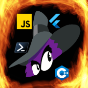
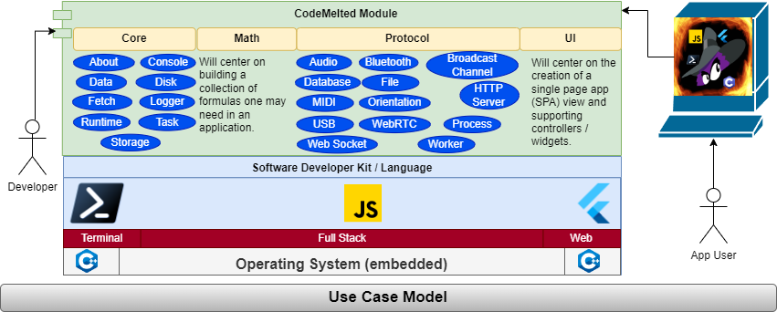
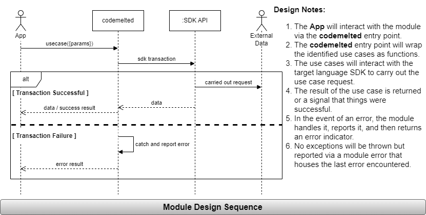

<center>
  <a title="CodeMelted - PWA" href="https://codemelted.com" target="_self_"></a>
  <div style="display: grid; grid-template-columns: auto auto auto auto auto; width: 100%; max-width: 500px;">
    <a title="Raspberry Pi Project" href="https://developer.codemelted.com/codemelted_pi" target="_self"></a>
    <a title="Embedded Module" href="https://developer.codemelted.com/codemelted_embedded/docs" target="_self"></a>
    <a title="Terminal Module" href="https://developer.codemelted.com/codemelted_terminal" target="_self"></a>
    <a title="Fullstack Module" href="https://developer.codemelted.com/codemelted_fullstack/docs" target="_self"></a>
    <a title="Web Module" href="https://developer.codemelted.com/codemelted_web/docs" target="_self"></a>
  </div>
  <div style="display: grid; grid-template-columns: auto auto auto; width: 100%; max-width: 500px;">
      <a id="btnDevGitHub" title="About Me" href="#" target="_blank"></a>
      <a id="btnDevSupport" title="Support My Work" target="_blank" href="#"></a>
      <a id="btnDevJSON" title="JSON Feed" href="#" target="_blank"></a>
  </div>
</center>

<h1>  CodeMelted Developer </h1>

"Write once, run anywhere (WORA)" was the famous slogan made by Sun Microsystems in 1995.  At the time, this technology allowed for easy full stack engineering allowing you to target dedicated workstations and on premise servers. So long as a Java Runtime Environment existed, you could run your code. Java was unable to keep to their slogan as web browsers became more advanced, mobile devices became ubiquitous, and companies no longer required dedicated servers.

Enter the Progressive Web Applications (PWA). A technology stack that utilizes the web browser as the ultimate runtime environment. You can run your application so long as a web browser is on the device. This is the same mantra and spirit of the original Java slogan.

The goal of this project is to aid software engineers in building and delivering on PWAs. It will implement a series of identified use cases across the different identified SDK technologies to support all aspects of a PWA. The later sections of this document will expand on this philosophy.

**Table of Contents**

- [Features](#features)
  - [Use Cases](#use-cases)
    - [Transactional](#transactional)
      - [About](#about)
      - [Console](#console)
      - [Data](#data)
      - [Error](#error)
      - [Logger](#logger)
      - [Math](#math)
      - [Runtime](#runtime)
      - [UI](#ui)
    - [Protocol](#protocol)
      - [Async](#async)
      - [Audio](#audio)
      - [Network](#network)
      - [Peripheral](#peripheral)
      - [Storage](#storage)
  - [Module Design](#module-design)
    - [Named Parameters](#named-parameters)
    - [Sequence of Events](#sequence-of-events)
    - [Error Handling](#error-handling)
- [Version](#version)
  - [Document](#document)
  - [Module](#module)
- [License](#license)

# Features

## Use Cases

<center>
  
</center>

### Transactional

#### About

TBD

#### Console

TBD

#### Data

TBD

#### Error

TBD

#### Logger

TBD

#### Math

TBD

#### Runtime

TBD

#### UI

TBD

### Protocol

TBD

#### Async

TBD

#### Audio

TBD

#### Network

TBD

#### Peripheral

TBD

#### Storage

TBD

## Module Design

<center>
  
</center>

### Named Parameters

TBD

### Sequence of Events

TBD

### Error Handling

TBD

# Version

The following documents the version of this document and explains the *CodeMelted Module* versioning scheme.

## Document

**23 Dec 2023:**

- Finalized design document to begin fleshing out this document.
- Stubbed all the different sections to begin filling it out.

## Module

```
X.Y.Z (dd mmm yyyy):
^ All module use cases are implemented
  ^ An individual use case becomes available
    ^ Use case fixes / tweaks
```

As the CodeMelted modules are developed, they will be versioned as identified above. A use case is considered available when a sufficient portion of its functionality is developed, tested, and documented. This will reset the `.Z` for any fixes made to existing available module use cases. When everything is done, it will be released as `1.0.0`.

- *NOTE: The `2.0.0` version of any module is considered something outside this design document. It will be covered with a similar document as this if something is ever considered worthy* 🙂.

# License

MIT License

© 2023 Mark Shaffer. All Rights Reserved.

Permission is hereby granted, free of charge, to any person obtaining a copy
of this software and associated documentation files (the "Software"), to deal
in the Software without restriction, including without limitation the rights
to use, copy, modify, merge, publish, distribute, sublicense, and/or sell
copies of the Software, and to permit persons to whom the Software is
furnished to do so, subject to the following conditions:

The above copyright notice and this permission notice shall be included in all
copies or substantial portions of the Software.

THE SOFTWARE IS PROVIDED "AS IS", WITHOUT WARRANTY OF ANY KIND, EXPRESS OR
IMPLIED, INCLUDING BUT NOT LIMITED TO THE WARRANTIES OF MERCHANTABILITY,
FITNESS FOR A PARTICULAR PURPOSE AND NONINFRINGEMENT. IN NO EVENT SHALL THE
AUTHORS OR COPYRIGHT HOLDERS BE LIABLE FOR ANY CLAIM, DAMAGES OR OTHER
LIABILITY, WHETHER IN AN ACTION OF CONTRACT, TORT OR OTHERWISE, ARISING FROM,
OUT OF OR IN CONNECTION WITH THE SOFTWARE OR THE USE OR OTHER DEALINGS IN THE SOFTWARE.

<script src="assets/js/codemelted_channel.js"></script>